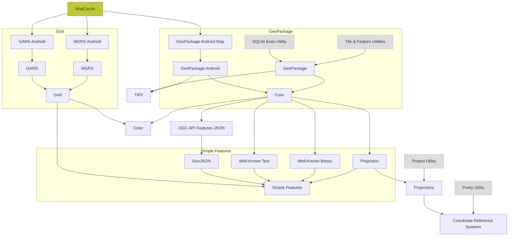

# Java & Android Dependency Graph

```mermaid
graph TD;

    MapCache-->GP_AndroidMap
    MapCache-->GD_MGRSAndroid
    MapCache-->GD_GARSAndroid
    subgraph GeoPackage
        GP_Utilities[Tile & Feature Utilities]-->GP
        GP_SQLiteExec[SQLite Exec Utility]-->GP
        GP[GeoPackage]-->GP_Core
        GP_AndroidMap[GeoPackage Android Map]-->GP_Android
        GP_Android[GeoPackage Android]-->GP_Core
        GP_Core[Core]
    end
    GP_Android-->TIFF
    GP-->TIFF
    GP_Core-->SF_WKB
    GP_Core-->SF_WKT
    GP_Core-->SF_Projection
    GP_Core-->OGCAPIFeatures
    GP_Core-->Color
    OGCAPIFeatures[OGC API Features JSON]-->SF_GeoJSON
    subgraph Simple Features
        SF_Projection[Projection]-->SF
        SF_WKB[Well-Known Binary]-->SF
        SF_WKT[Well-Known Text]-->SF
        SF_GeoJSON[GeoJSON]-->SF
        SF[Simple Features]
    end
    SF_Projection-->Projections
    ProjectUtility[Project Utility]-->Projections
    PrettyUtility[Pretty Utility]-->CRS
    Projections-->CRS
    CRS[Coordinate Reference Systems]
    subgraph Grid
        GD_MGRSAndroid[MGRS Android]-->GD_MGRS
        GD_GARSAndroid[GARS Android]-->GD_GARS
        GD_MGRS[MGRS]-->GD
        GD_GARS[GARS]-->GD
        GD[Grid]
    end
    GD-->Color
    GD-->SF
    
    click MapCache "https://github.com/ngageoint/geopackage-mapcache-android" "MapCache Android" _blank
    click GP_AndroidMap "https://github.com/ngageoint/geopackage-android-map" "GeoPackage Android Map" _blank
    click GP_Android "https://github.com/ngageoint/geopackage-android" "GeoPackage Android" _blank
    click GP_SQLiteExec "https://github.com/ngageoint/geopackage-java/tree/master/script/sqlite-exec" "SQLite Exec" _blank
    click GP_Utilities "https://github.com/ngageoint/geopackage-java#standalone-utilities" "Standalone Utilities" _blank
    click GP "https://github.com/ngageoint/geopackage-java" "GeoPackage Java" _blank
    click GP_Core "https://github.com/ngageoint/geopackage-core-java" "GeoPackage Core Java" _blank
    click TIFF "https://github.com/ngageoint/tiff-java" "TIFF Java" _blank
    click GD_GARSAndroid "https://github.com/ngageoint/gars-android" "GARS Android" _blank
    click GD_MGRSAndroid "https://github.com/ngageoint/mgrs-android" "MGRS Android" _blank
    click GD_GARS "https://github.com/ngageoint/gars-java" "GARS Java" _blank
    click GD_MGRS "https://github.com/ngageoint/mgrs-java" "MGRS Java" _blank
    click GD "https://github.com/ngageoint/grid-java" "Grid Java" _blank
    click Color "https://github.com/ngageoint/color-java" "Color Java" _blank
    click OGCAPIFeatures "https://github.com/ngageoint/ogc-api-features-json-java" "OGC API Features JSON Java" _blank
    click SF_Projection "https://github.com/ngageoint/simple-features-proj-java" "Simple Features Projection Java" _blank
    click SF_WKB "https://github.com/ngageoint/simple-features-wkb-java" "Simple Features WKB Java" _blank
    click SF_WKT "https://github.com/ngageoint/simple-features-wkt-java" "Simple Features WKT Java" _blank
    click SF_GeoJSON "https://github.com/ngageoint/simple-features-geojson-java" "Simple Features GeoJSON Java" _blank
    click SF "https://github.com/ngageoint/simple-features-java" "Simple Features Java" _blank
    click ProjectUtility "https://github.com/ngageoint/projections-java/tree/master/script/project" "Project" _blank
    click Projections "https://github.com/ngageoint/projections-java" "Projections Java" _blank
    click PrettyUtility "https://github.com/ngageoint/coordinate-reference-systems-java/tree/master/script/pretty" "Pretty" _blank
    click CRS "https://github.com/ngageoint/coordinate-reference-systems-java" "Coordinate Reference Systems Java" _blank
    
    style MapCache fill:#bec833
    style GP_Utilities fill:#ddd,stroke-dasharray: 5 5
    style GP_SQLiteExec fill:#ddd,stroke-dasharray: 5 5
    style ProjectUtility fill:#ddd,stroke-dasharray: 5 5
    style PrettyUtility fill:#ddd,stroke-dasharray: 5 5
    
```
