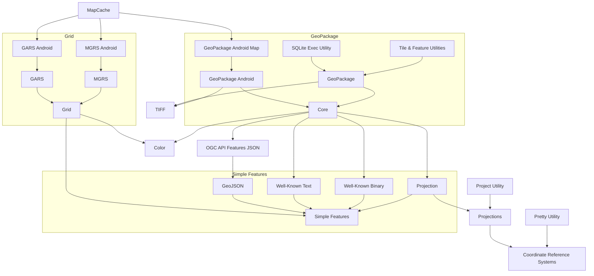

# Java & Android Dependency Graph

```mermaid
graph TD;
    MapCache-->GP_AndroidMap
    MapCache-->GD_MGRSAndroid
    MapCache-->GD_GARSAndroid
    subgraph GeoPackage
        GP_Utilities[Tile & Feature Utilities]-->GP
        GP_SQLiteExec[SQLite Exec Utility]-->GP
        GP[GeoPackage]-->GP_Core
        GP_AndroidMap[GeoPackage Android Map]-->GP_Android
        GP_Android[GeoPackage Android]-->GP_Core
        GP_Core[Core]
    end
    GP_Android-->TIFF
    GP-->TIFF
    GP_Core-->SF_WKB
    GP_Core-->SF_WKT
    GP_Core-->SF_Projection
    GP_Core-->OGCAPIFeatures
    GP_Core-->Color
    OGCAPIFeatures[OGC API Features JSON]-->SF_GeoJSON
    subgraph Simple Features
        SF_Projection[Projection]-->SF
        SF_WKB[Well-Known Binary]-->SF
        SF_WKT[Well-Known Text]-->SF
        SF_GeoJSON[GeoJSON]-->SF
        SF[Simple Features]
    end
    SF_Projection-->Projections
    ProjectUtility[Project Utility]-->Projections
    PrettyUtility[Pretty Utility]-->CRS
    Projections-->CRS
    CRS[Coordinate Reference Systems]
    subgraph Grid
        GD_MGRSAndroid[MGRS Android]-->GD_MGRS
        GD_GARSAndroid[GARS Android]-->GD_GARS
        GD_MGRS[MGRS]-->GD
        GD_GARS[GARS]-->GD
        GD[Grid]
    end
    GD-->Color
    GD-->SF
```
