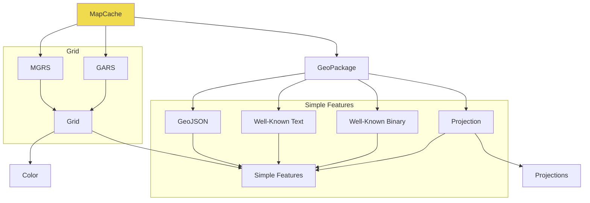

# JavaScript Dependency Graph

```mermaid
graph TD;

    MapCache-->GD_MGRS
    MapCache-->GD_GARS
    MapCache-->GeoPackage
    GeoPackage-->SF_GeoJSON
    GeoPackage-->SF_WKT
    GeoPackage-->SF_WKB
    GeoPackage-->SF_Projection
    subgraph Simple Features
        SF_Projection[Projection]-->SF
        SF_WKB[Well-Known Binary]-->SF
        SF_WKT[Well-Known Text]-->SF
        SF_GeoJSON[GeoJSON]-->SF
        SF[Simple Features]
    end
    SF_Projection-->Projections
    subgraph Grid
        GD_MGRS[MGRS]-->GD
        GD_GARS[GARS]-->GD
        GD[Grid]
    end
    GD-->Color
    GD-->SF
    
    click MapCache "https://github.com/ngageoint/mapcache-electron" "MapCache Desktop" _blank
    click GeoPackage "https://github.com/ngageoint/geopackage-js" "GeoPackage JavaScript" _blank
    click GD_GARS "https://github.com/ngageoint/gars-js" "GARS JavaScript" _blank
    click GD_MGRS "https://github.com/ngageoint/mgrs-js" "MGRS JavaScript" _blank
    click GD "https://github.com/ngageoint/grid-js" "Grid JavaScript" _blank
    click Color "https://github.com/ngageoint/color-js" "Color JavaScript" _blank
    click SF_Projection "https://github.com/ngageoint/simple-features-proj-js" "Simple Features Projection JavaScript" _blank
    click SF_WKB "https://github.com/ngageoint/simple-features-wkb-js" "Simple Features WKB JavaScript" _blank
    click SF_WKT "https://github.com/ngageoint/simple-features-wkt-js" "Simple Features WKT JavaScript" _blank
    click SF_GeoJSON "https://github.com/ngageoint/simple-features-geojson-js" "Simple Features GeoJSON JavaScript" _blank
    click SF "https://github.com/ngageoint/simple-features-js" "Simple Features JavaScript" _blank
    click Projections "https://github.com/ngageoint/projections-js" "Projections JavaScript" _blank
    
    style MapCache fill:#f0db4f,color:#323330
    
```
