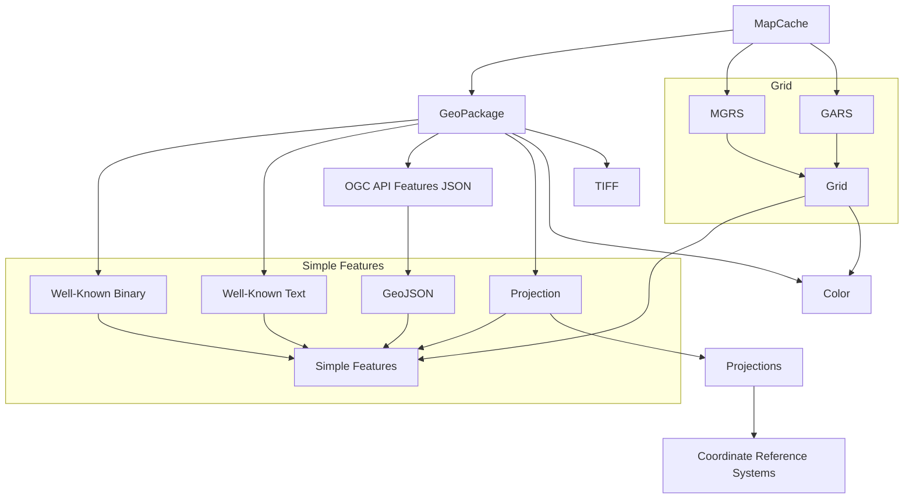

```mermaid
graph TD;
    MapCache-->GeoPackage
    MapCache-->GD_MGRS
    MapCache-->GD_GARS
    GeoPackage-->SF_WKB
    GeoPackage-->SF_WKT
    GeoPackage-->OGCAPIFeatures
    GeoPackage-->SF_Projection
    GeoPackage-->Color
    GeoPackage-->TIFF
    OGCAPIFeatures[OGC API Features JSON]-->SF_GeoJSON
    subgraph Simple Features
        SF_Projection[Projection]-->SF
        SF_WKB[Well-Known Binary]-->SF
        SF_WKT[Well-Known Text]-->SF
        SF_GeoJSON[GeoJSON]-->SF
        SF[Simple Features]
    end
    SF_Projection-->Projections
    Projections-->CRS[Coordinate Reference Systems]
    subgraph Grid
        GD_MGRS[MGRS]-->GD
        GD_GARS[GARS]-->GD
        GD[Grid]
    end
    GD-->SF
    GD-->Color
```
