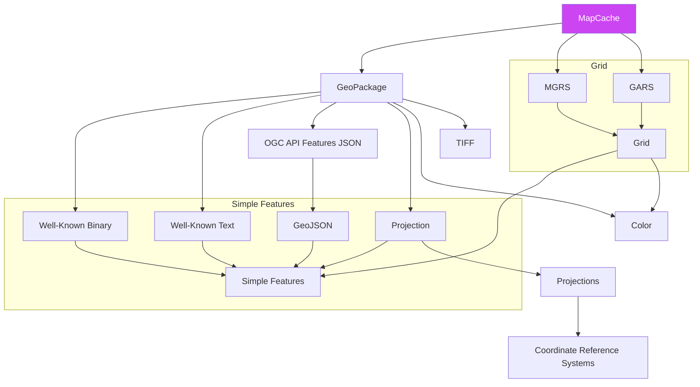

# iOS Dependency Graph

```mermaid
graph TD;

    MapCache-->GeoPackage
    MapCache-->GD_MGRS
    MapCache-->GD_GARS
    GeoPackage-->SF_WKB
    GeoPackage-->SF_WKT
    GeoPackage-->OGCAPIFeatures
    GeoPackage-->SF_Projection
    GeoPackage-->Color
    GeoPackage-->TIFF
    OGCAPIFeatures[OGC API Features JSON]-->SF_GeoJSON
    subgraph Simple Features
        SF_Projection[Projection]-->SF
        SF_WKB[Well-Known Binary]-->SF
        SF_WKT[Well-Known Text]-->SF
        SF_GeoJSON[GeoJSON]-->SF
        SF[Simple Features]
    end
    SF_Projection-->Projections
    Projections-->CRS
    CRS[Coordinate Reference Systems]
    subgraph Grid
        GD_MGRS[MGRS]-->GD
        GD_GARS[GARS]-->GD
        GD[Grid]
    end
    GD-->SF
    GD-->Color
    
    click MapCache "https://github.com/ngageoint/geopackage-mapcache-ios" "MapCache iOS" _blank
    click GeoPackage "https://github.com/ngageoint/geopackage-ios" "GeoPackage iOS" _blank
    click TIFF "https://github.com/ngageoint/tiff-ios" "TIFF iOS" _blank
    click GD_GARS "https://github.com/ngageoint/gars-ios" "GARS iOS" _blank
    click GD_MGRS "https://github.com/ngageoint/mgrs-ios" "MGRS iOS" _blank
    click GD "https://github.com/ngageoint/grid-ios" "Grid iOS" _blank
    click Color "https://github.com/ngageoint/color-ios" "Color iOS" _blank
    click OGCAPIFeatures "https://github.com/ngageoint/ogc-api-features-json-ios" "OGC API Features JSON iOS" _blank
    click SF_Projection "https://github.com/ngageoint/simple-features-proj-ios" "Simple Features Projection iOS" _blank
    click SF_WKB "https://github.com/ngageoint/simple-features-wkb-ios" "Simple Features WKB iOS" _blank
    click SF_WKT "https://github.com/ngageoint/simple-features-wkt-ios" "Simple Features WKT iOS" _blank
    click SF_GeoJSON "https://github.com/ngageoint/simple-features-geojson-ios" "Simple Features GeoJSON iOS" _blank
    click SF "https://github.com/ngageoint/simple-features-ios" "Simple Features iOS" _blank
    click Projections "https://github.com/ngageoint/projections-ios" "Projections iOS" _blank
    click CRS "https://github.com/ngageoint/coordinate-reference-systems-ios" "Coordinate Reference Systems iOS" _blank
    
    style MapCache fill:#cc45f2,color:#fff
    
```
